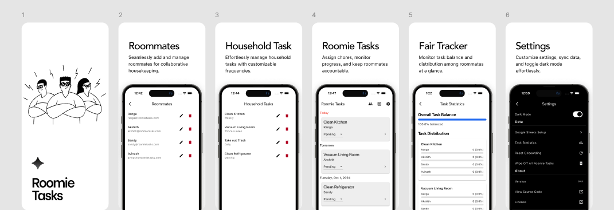

# Roomie Tasks

![coverage][coverage_badge]
[![style: very good analysis][very_good_analysis_badge]][very_good_analysis_link]
[![License: MIT][license_badge]][license_link]

Roomie Tasks is a Flutter application for managing shared tasks among roommates.



## Getting Started 🚀

### Prerequisites

- Flutter SDK (version 3.5.3 or later)
- Dart SDK (version 3.5.3 or later)
- Git
- [Task](https://taskfile.dev/) (optional, for running predefined tasks)

### Setup

1. Clone the repository:

   ```bash
   git clone https://github.com/yourusername/roomie_tasks.git
   cd roomie_tasks
   ```

2. Install dependencies:

   ```bash
   flutter pub get
   ```

3. Set up Git hooks:

   ```bash
   git config core.hooksPath .git_hooks
   chmod +x .git_hooks/pre-commit
   chmod +x .git_hooks/commit-msg
   ```

4. To run the app refer [Development](#development)

## Development

This project contains 3 flavors:

- development
- staging
- production

To run the desired flavor either use the launch configuration in VSCode/Android Studio or use the following commands:

```sh
# Development
$ flutter run --flavor development --target lib/main_development.dart

# Staging
$ flutter run --flavor staging --target lib/main_staging.dart

# Production
$ flutter run --flavor production --target lib/main_production.dart
```

### Using Task

If you have Task installed, you can use the following commands:

```sh
# List all available tasks
$ task

# Install dependencies
$ task get

# Format code
$ task format

# Analyze code
$ task analyze

# Run tests
$ task test

# Generate coverage report
$ task coverage

# Run development flavor
$ task dev

# Run staging flavor
$ task staging

# Run production flavor
$ task production

# Build APK (Production)
$ task build:apk

# Build App Bundle (Production)
$ task build:appbundle

# Build IPA (Production)
$ task build:ipa
```

## Running Tests 🧪

To run all unit and widget tests use the following command:

```bash
# Testing
$ flutter test --coverage --test-randomize-ordering-seed random
```

To view the generated coverage report you can use [lcov](https://github.com/linux-test-project/lcov).

```sh
# Generate Coverage Report
$ genhtml coverage/lcov.info -o coverage/

# Open Coverage Report
$ open coverage/index.html
```

## Contributing

We welcome contributions! Please see our [Contributing Guidelines](CONTRIBUTING.md) for more details.

[coverage_badge]: coverage_badge.svg
[license_badge]: https://img.shields.io/badge/license-MIT-blue.svg
[license_link]: https://opensource.org/licenses/MIT
[very_good_analysis_badge]: https://img.shields.io/badge/style-very_good_analysis-B22C89.svg
[very_good_analysis_link]: https://pub.dev/packages/very_good_analysis
